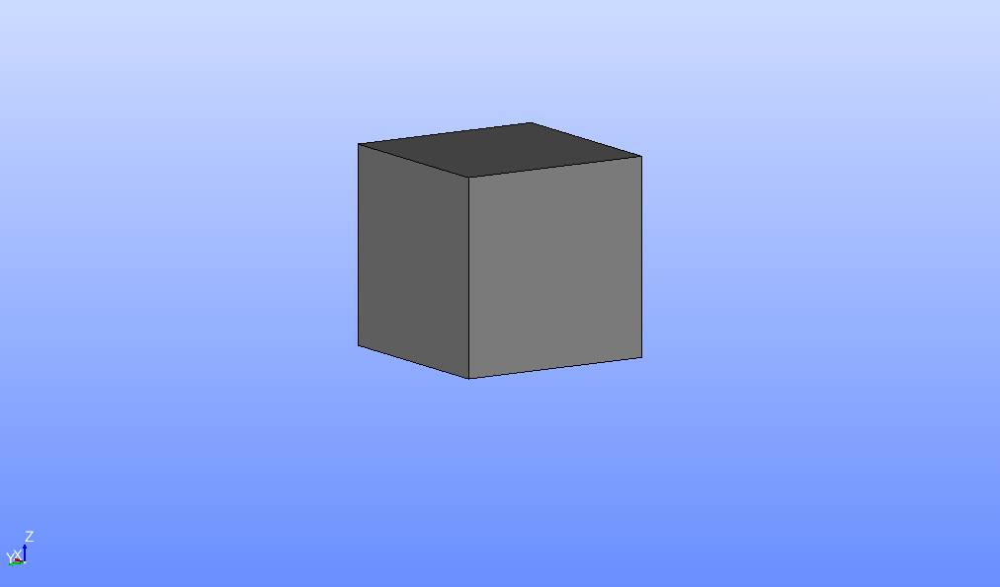
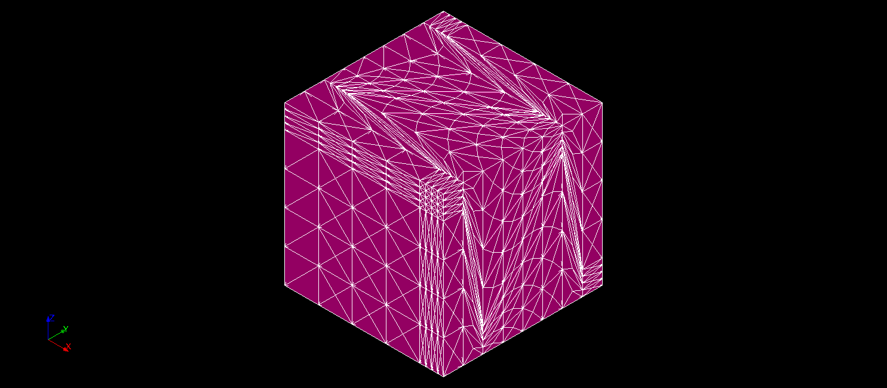
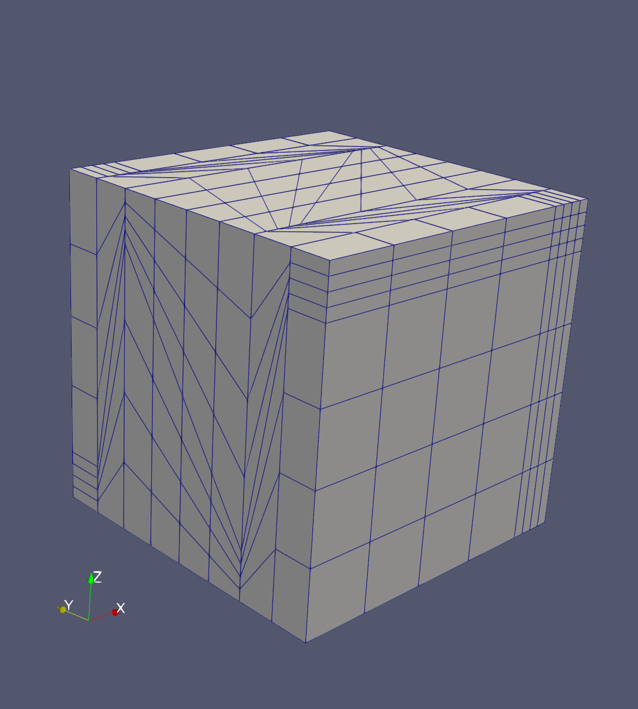

# Cube domain

|   |
|:--:|
| **CAD of the cube domain** |

The domain is a regular cube.
The cube meshes belong to three families.
- uniform hexahedra  (compatible with finite difference or finite volume discretisations)  
    
  The meshes originate from the conference [FVCA6 benchmark](https://github.com/ndjinga/FVCA\_Meshes) in Prague, 2011.
  | | mesh\_hexa\_1 | mesh\_hexa\_2 | mesh\_hexa\_3 | mesh\_hexa\_4 | mesh\_hexa\_5 |
  | --- | --- | --- | --- | --- | --- |
  | Number of nodes | 27 | 125 | 729 | 4913 | 35937 |
  | Number of cells | 8 | 64 | 512 | 4096 | 32768 |
- gentle tetrahedra (compatible with finite elements or finite volume discretisations)  
    
  The meshes originate from the conference [FVCA6 benchmark](https://github.com/ndjinga/FVCA\_Meshes) in Prague, 2011.
  |  | mesh\_tetra\_0 | mesh\_tetra\_1 | mesh\_tetra\_2 | mesh\_tetra\_3 | mesh\_tetra\_4 | mesh\_tetra\_5 | mesh\_tetra\_6 |
  | --- | --- | --- | --- | --- | --- | --- | --- |
  | Number of nodes | 80 | 488 | 857 | 1601 | 2997 | 5692 | 10994 |
  | Number of cells | 215 | 2003 | 3898 | 7711 | 15266 | 30480 | 61052 |
- tough tetrahedra (compatible with finite elements or finite volume discretisations)  
    
  The meshes where obtained by tetrahedrisation of the Kershaw meshes from the conference [FVCA6 benchmark](https://github.com/ndjinga/FVCA\_Meshes) in Prague, 2011.
  |  | 3DKershawTetra1 | 3DKershawTetra2 | 3DKershawTetra3 |
  | --- | --- | --- | --- |
  | Number of nodes | 3865 | 31793 | 258145 |
  | Number of cells | 11072 | 93440 | 766976 |
- Kershaw polyhedra (compatible with finite volume discretisation)  
    
  The meshes originate from the conference [FVCA6 benchmark](https://github.com/ndjinga/FVCA\_Meshes) in Prague, 2011.
  |  | Kershaw1 | Kershaw2 | Kershaw3 | Kershaw4 |
  | --- | --- | --- | --- | --- |
  | Number of nodes | 729 | 4913 | 35937 | 274625 |
  | Number of cells | 512 | 4096 | 32768 | 262144 |

