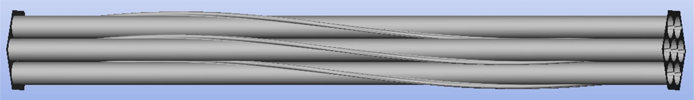
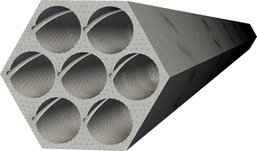
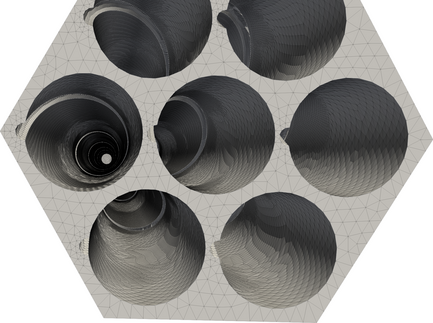

|  |
|:--:|
| **Nuclear assembly domain** |

The domain is a channel with hexagonal cross-section, obstructed by a 7-pin nuclear assembly wrapped with wires.  

We provide a single familly of tetrahedra meshes for the fluid domain (compatible with finite elements or finite volume discretisations)  

  
    

  |  | AssemblyMesh1 | AssemblyMesh2 | AssemblyMesh3 | AssemblyMesh4 | AssemblyMesh5 | AssemblyMesh6 |
  | --- | --- | --- | --- | --- | --- | --- |
  | Number of nodes | 4999 | 15272 | 40976 | 63608 | 114915 | 209460 |
  | Number of cells | 18122 | 49571 | 131979 | 218307 | 435021 | 808837 |

The MED files where generated using SALOME and the python script GenerateMeshFromSalomeNetGen.py 
which reads the geometry in file assemblage.xao and meshes it thanks to the library NETGEN.  

The msh files where obtained by converting the MED files using the software gmsh via the command  
gmsh -1 ./my_mesh.med -save_all -o my_mesh.msh  
